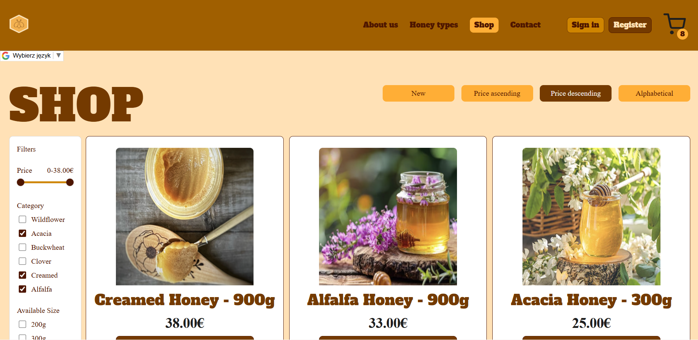
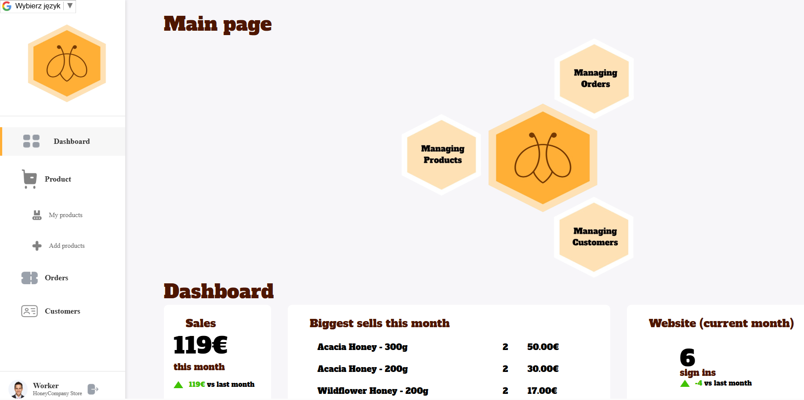

# 🍯 Honey Shop Web Application

A fullstack web application for a honey shop built with **HTML, CSS, JavaScript (frontend)** and **Node.js + PostgreSQL (backend)**.  
The project is fully containerized with **Docker Compose** for easy setup and deployment.

---

## Preview

### Shop Page



### Admin Panel



---

## Features

- Static frontend built with vanilla **HTML, CSS, JS**
- Dynamic backend built in **Node.js (Express)**
- Database layer with **PostgreSQL**
- Predefined schema and demo data (products, users, orders)
- Ready-to-use **Docker Compose setup**

---

## Project Structure

```
Fullstack_Honey_Shop_Web
├── backend/           # Express.js backend
├── database/          # Database schema & init data
├── frontend/          # Static HTML/CSS/JS frontend
├── imagesReadme/      # Screenshots for README
├── docker-compose.yaml
├── LICENSE
└── README.md
```

---

## Quick Start (Docker Compose)

### 1. Clone the repository

```bash
git clone https://github.com/mwojciechowski653/fullstack-honey-shop-web.git
cd fullstack_honey_shop_web
```

### 2. Build and run the containers

```bash
docker-compose up --build
```

This will start three services:

- **frontend** → available at [http://localhost:8080](http://localhost:8080/...)
- **backend** → available at [http://localhost:5000](http://localhost:5000/api/...)
- **postgres** → database with initialized schema and demo data

**Main page's URL**: [http://localhost:8080/pages/homePage.html](http://localhost:8080/pages/homePage.html)

### 3. Stop the containers

```bash
docker-compose down
```

---

## Database

The database is automatically initialized on first run with:

- Users
- Products & size options
- Orders & order items

**Sample user**: jan@kowalski.com with password: Pass123@
**Sample admin**: admin@honeyshop.com with password: Pass123@

If you want to reset the database and reload demo data:

```bash
docker-compose down -v
docker-compose up --build
```

---

## Notes for Development

- All API endpoints are prefixed with `/api/...`
- If you add new images for products, place them in `frontend/images/` and update their `image_url` paths in the database. This is temporary solution for docker-compose setup, because originally images were uploaded to external service: [Supabase](https://supabase.com/).

---

## Authors

Project developed as part of a **Web Technologies** subject at Universidad de Almeria in 2025.

- **Antoni Gąsior**\
  [GitHub](https://github.com/Terrokz)
- **Paulina Korus**\
  [GitHub](https://github.com/paulinakorus)
- **Arek Maliński**\
  [GitHub](https://github.com/Areq1)
- **Natalia Polak**\
  [GitHub](https://github.com/NataliaPolak13)
- **Marcin Wojciechowski**\
  [GitHub](https://github.com/mwojciechowski653)

## License

This project is licensed under the **MIT** license.\
The full license text can be found in the [LICENSE](LICENSE) file.

In short: you are free to use, copy, modify, and distribute this code under the MIT terms. The software is provided “as is”, without any warranty.
